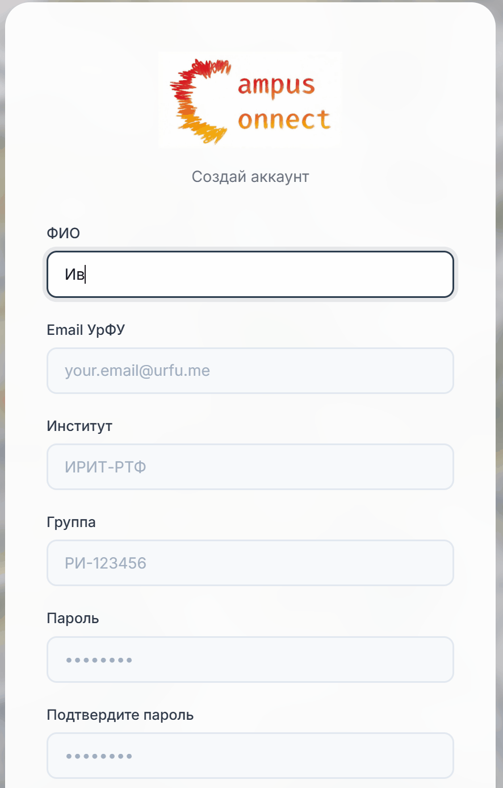
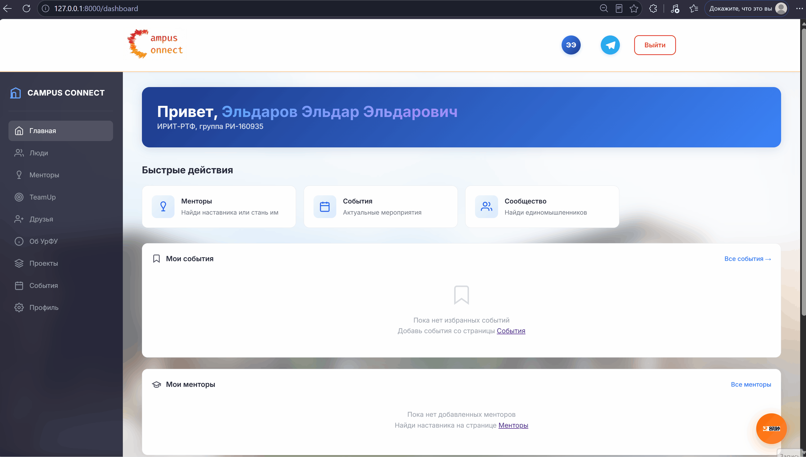
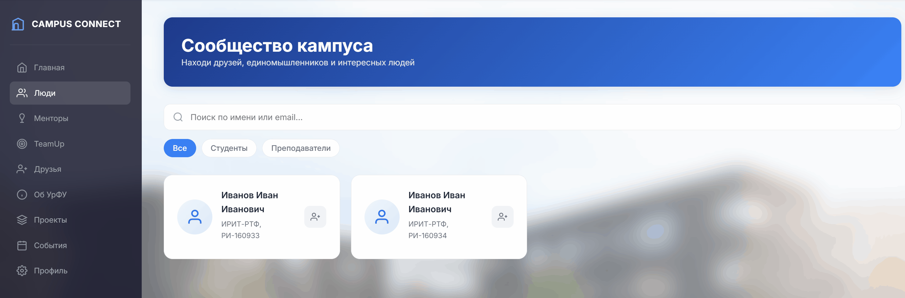
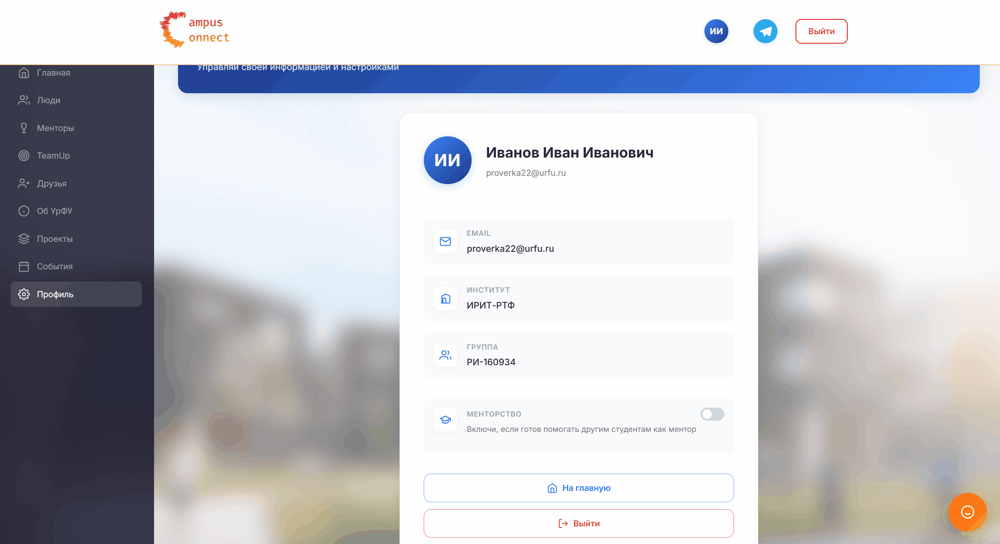
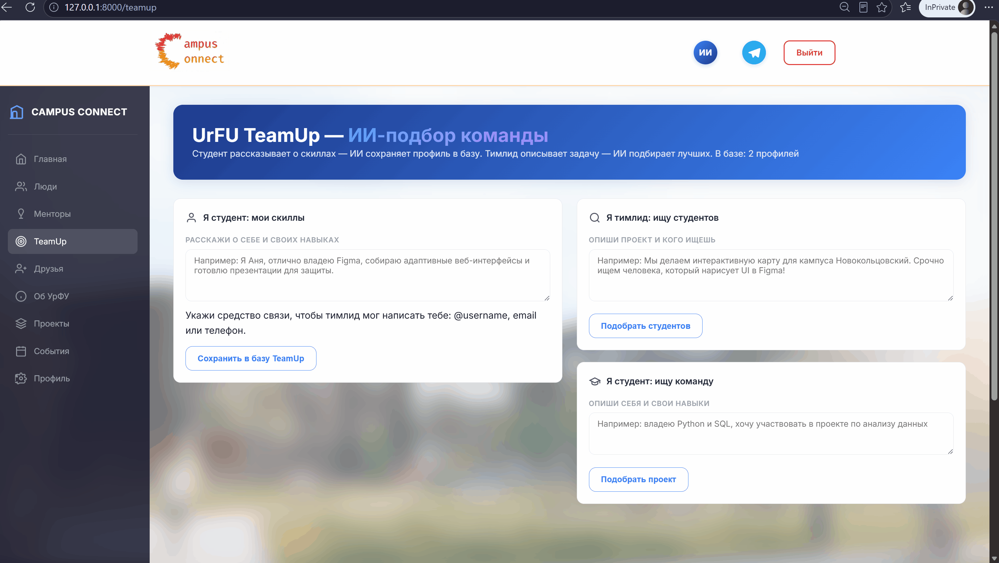

<div align="center">

#  Campus Connect — УрФУ

**Единая цифровая платформа кампуса: события, знакомства, менторство и ИИ-подбор команды**

[](https://www.python.org/)
[](https://fastapi.tiangolo.com/)
[](https://www.sqlalchemy.org/)
[](LICENSE)

</div>

---

##  О проекте

**Campus Connect** — веб-платформа для студентов УрФУ, которая закрывает сразу несколько задач:

-  единая лента студенческих событий и мероприятий;
-  система друзей и заявок;
-  менторская программа (студенты помогают студентам);
-  **TeamUp** — подбор команды и участников проектов на основе ИИ (GigaChat);
-  личный кабинет, избранное, профиль с навыками.

Проект сделан на **FastAPI + SQLAlchemy + Jinja2**, с JWT-авторизацией через cookie.

---

## 🎬 Демонстрация

### Авторизация и регистрация


### Лента событий и избранное


### Друзья и заявки


### Менторская программа


### TeamUp — ИИ-подбор команды


---

## ⚙️ Технологии

| Категория | Стек |
|---|---|
| Backend | FastAPI, Uvicorn |
| БД / ORM | SQLAlchemy, Alembic |
| Авторизация | python-jose (JWT), passlib + bcrypt |
| Шаблоны | Jinja2 |
| ИИ | GigaChat, scikit-learn |
| Конфиг | pydantic-settings, python-dotenv |

---

## 🚀 Быстрый старт

```bash
# 1. Клонируем репозиторий
git clone https://github.com/SanMartin1337/hakaton.git
cd hakaton

# 2. Создаём виртуальное окружение
python -m venv venv
source venv/bin/activate      # Windows: venv\Scripts\activate

# 3. Устанавливаем зависимости
pip install -r requirements.txt

# 4. Настраиваем переменные окружения
cp .env.example .env           # заполни SECRET_KEY, ключи GigaChat и т.д.

# 5. Запускаем сервер
python main.py
# либо: uvicorn main:app --reload
```

Приложение будет доступно на `http://127.0.0.1:8000`.

---

## 📂 Структура проекта

```
hakaton/
├── app/
│   ├── api/v1/          # роуты: auth, chat, users
│   ├── models/           # User, FriendRequest, UserEvent
│   ├── services/         # teamup.py — интеграция с GigaChat
│   ├── templates/        # Jinja2-шаблоны
│   └── static/           # статика (css/js/images)
├── main.py               # точка входа FastAPI
├── requirements.txt
└── .env
```

---

##  Основные возможности

- [x] Регистрация и вход по email/паролю (JWT в httponly cookie)
- [x] Лента событий с добавлением в избранное
- [x] Система заявок в друзья / менторы
- [x] Личный кабинет с профилем и навыками
- [x] TeamUp: ИИ-подбор тиммейтов по текстовому описанию
- [ ] Уведомления в реальном времени
- [ ] Мобильная версия


<div align="center">

Сделано с ❤️ для студентов УрФУ

</div>
